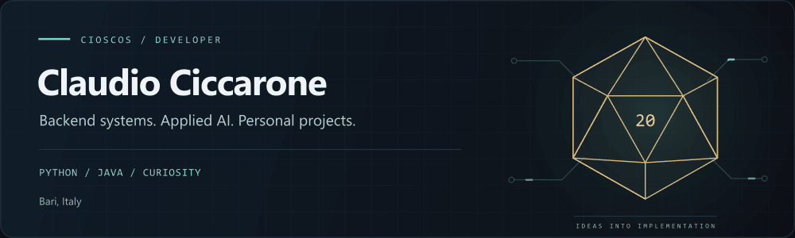

<picture>
  <source media="(prefers-reduced-motion: reduce) and (prefers-color-scheme: light)" srcset="assets/profile-light.svg">
  <source media="(prefers-reduced-motion: reduce)" srcset="assets/profile-dark.svg">
  <source media="(prefers-color-scheme: light)" srcset="assets/profile-light.gif">
  
</picture>

# Claudio Ciccarone

**Software Developer · Backend systems · Applied AI**

Based in Bari, Italy · DXC Technology · Online as **Cioscos**

[Portfolio](https://cioscos.github.io/my-portfolio/) · [Projects](#selected-projects) · [Toolbox](#technical-toolbox) · [Beyond the code](#beyond-the-code)

---

## About me

I'm a software developer with a focus on backend development and an interest in applied AI, data workflows and cloud architecture. My main languages are **Python and Java**, with **FastAPI and Spring Boot** in my backend toolkit.

My personal projects are where I turn curiosity into working software: a D&D companion for Telegram, audio visualization tools, and utilities for image restoration and dataset preparation. I enjoy the work between an interesting idea and a tool someone can actually use.

Gaming and tabletop RPGs are part of that curiosity. Sometimes they stay hobbies; sometimes they become the reason to build something.

## Technical toolbox

| Area | Technologies |
| :--- | :--- |
| **Backend & APIs** | Python · Java · FastAPI · Spring Boot · GraphQL |
| **Data & storage** | PostgreSQL · Databricks |
| **Web** | JavaScript · TypeScript · HTML · CSS |
| **Development environment** | Git · Docker · Linux |

<strong>Areas I am exploring</strong> — AI, data and infrastructure

- **Applied AI:** local LLM experiments and image restoration workflows.
- **Data workflows:** preparing datasets and building utilities around machine learning tools.
- **Cloud architecture:** deepening my understanding of how backend services are deployed and operated.

These are areas of interest and ongoing learning, alongside my core software development work.

## Selected projects

Personal work across backend development, creative tools and machine learning utilities. Each project links directly to its source and documentation.

<table>
<tr>
<td width="50%" valign="top">
<h3>01 · Adventurer's Tome</h3>

<strong>A practical companion for the D&amp;D table.</strong>

A Telegram bot combining a browsable D&amp;D 5e wiki, persistent character management and live party updates.

GraphQL integration, asynchronous handlers and SQLite persistence bring the game rules and session state into one conversational interface.

<code>Python</code> <code>GraphQL</code> <code>SQLite</code>

<a href="https://github.com/Cioscos/DnD-Adventurers-Tome-TGBot"><strong>Explore Adventurer's Tome →</strong></a>

</td>
<td width="50%" valign="top">
<h3>02 · Sound Wave</h3>

<strong>Audio you can see.</strong>

A desktop audio visualizer with real-time frequency analysis, multiple visualization modes and customizable profiles.

Combines FFT-based audio processing with OpenGL rendering and a PySide6 control panel, inspired by the visual language of classic stereos.

<code>Python</code> <code>OpenGL</code> <code>PySide6</code>

<a href="https://github.com/Cioscos/easy-graphic-equalizer"><strong>Explore Sound Wave →</strong></a>

</td>
</tr>
<tr>
<td width="50%" valign="top">
<h3>03 · GPEN utilities</h3>

<strong>Image restoration workflows.</strong>

Personal scripts and integrations within the GPEN Windows standalone package, including launchers for different restoration workflows.

Builds on the upstream GPEN ecosystem, with a focus on practical local usage.

<code>Python</code> <code>Computer vision</code> <code>Windows</code>

<a href="https://github.com/Cioscos/GPEN-Cioscos"><strong>Explore GPEN utilities →</strong></a>

</td>
<td width="50%" valign="top">
<h3>04 · DFL Dataset Creator</h3>

<strong>Dataset preparation with a specific purpose.</strong>

A utility for creating a dataset based on the yaw and pitch of a destination dataset, supporting pose-aware preparation for DeepFaceLab workflows.

A focused example of tooling around the data preparation stage of an ML workflow.

<code>Python</code> <code>Dataset tooling</code> <code>DeepFaceLab</code>

<a href="https://github.com/Cioscos/DFL-Dataset-creator"><strong>Explore Dataset Creator →</strong></a>

</td>
</tr>
</table>

[Browse all repositories →](https://github.com/Cioscos?tab=repositories)

## Beyond the code

**Video games, D&D 5e and audio** are recurring interests. I like exploring game systems, sharing a campaign with a party, and experimenting with how sound can become something visual.

<strong>Optional side quest: the character sheet</strong>

| Field | Notes |
| :--- | :--- |
| **Handle** | Cioscos |
| **Home base** | Bari, Italy |
| **At the keyboard** | Backend development, Python tools and local AI experiments |
| **At the table** | D&D 5e player |
| **Off the clock** | Video games, audio and ideas for the next personal project |

The connection is simple: I enjoy understanding systems, whether they run on code or a set of game rules.

## Find me

For more about my work, visit my **[portfolio](https://cioscos.github.io/my-portfolio/)**. For project-specific questions, ideas or contributions, use the issue tracker in the relevant repository.

**[Portfolio ↗](https://cioscos.github.io/my-portfolio/)** &nbsp; · &nbsp; **[GitHub ↗](https://github.com/Cioscos)**

---

  Claudio Ciccarone · Cioscos · Software, curiosity, and the occasional d20.

